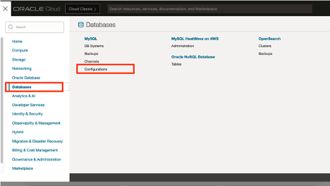
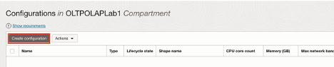
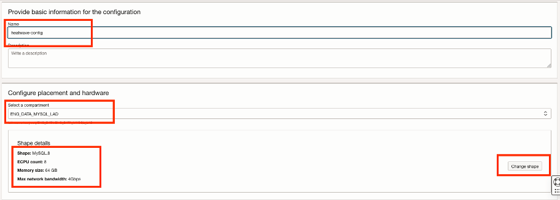
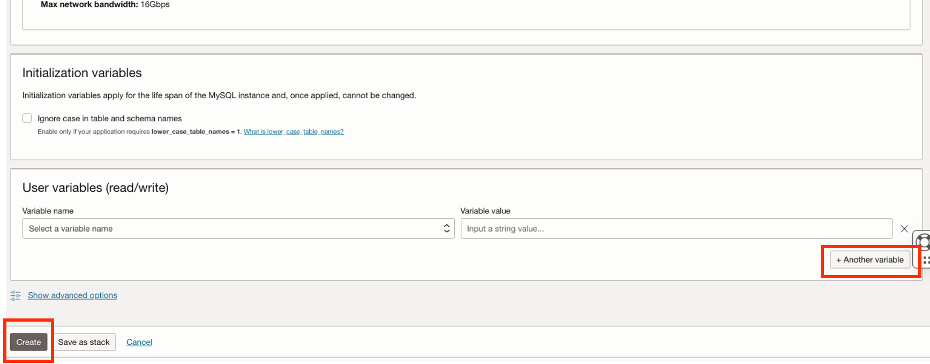
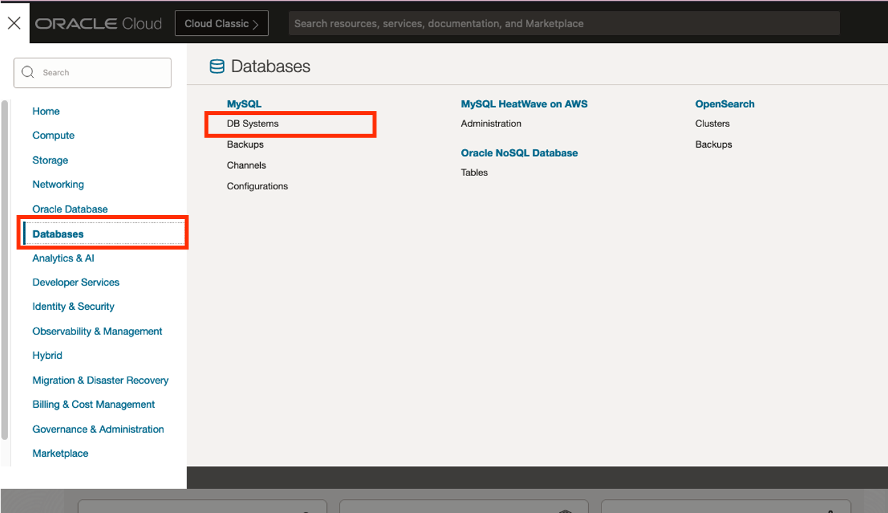
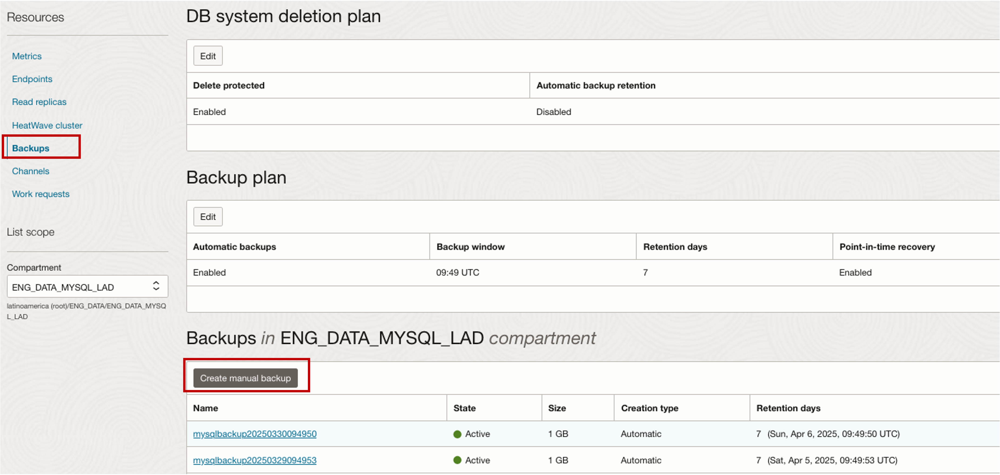
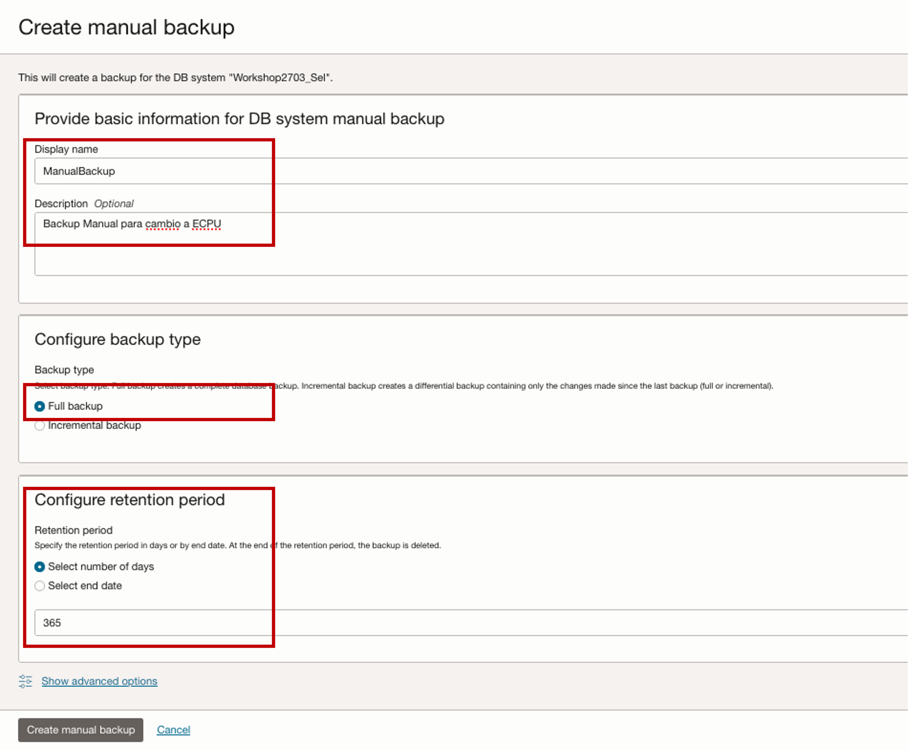
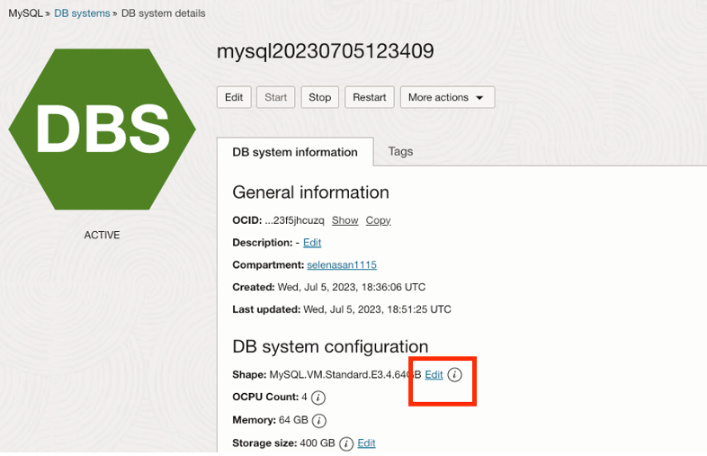
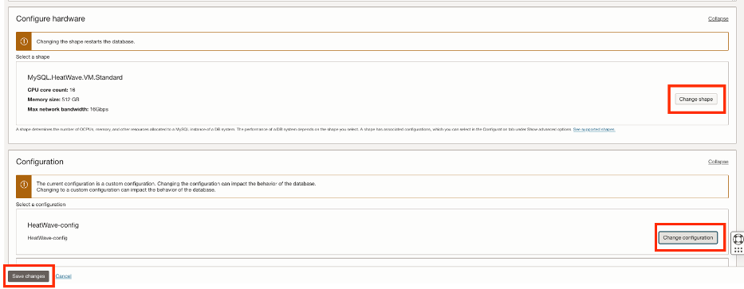
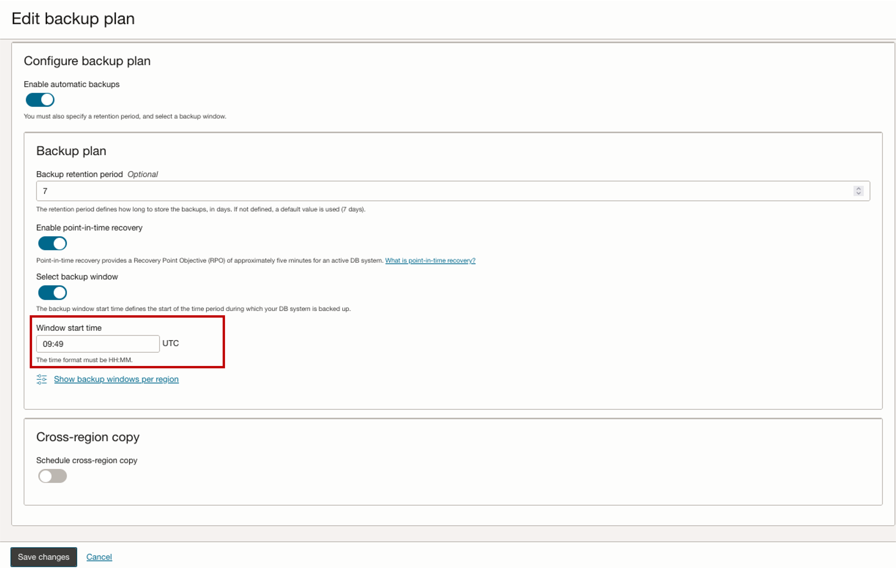

# Mejores prácticas

## Introduction

Describe the lab in one or two sentences, for example:* This lab walks you through the steps to ...

## Cambio a ECPU (para usuarios de shapes OCPU)

**NOTA:** Este proceso implica un reinicio del DBSystem, el cual toma alrededor de 30 minutos, planee acorde. Es recomendable habilitar **Alta Disponibilidad** para disminuir/evitar este downtime. 

**Crea un nueva configuración**
1.	Da click en el menú de hamburguesa, después en Databases y Configurations 
  
2.	De click en Create Configuration
  
3.	Asigna un nombre, selecciona un compartimento y el shape deseado
  
4. Personaliza las variables necesarias y al terminar, da click en Create

  **NOTA**: Recuerda asimilar esta configuración a tu configuración actual con OCPU si es que realizaste cambios (como sql_mode,time_zone, etc), y verificar la variable de inicialización (lower_case_table_names) 
  

**Crea un backup manual (Opcional)**
Este paso es opcional, pero es recomendable si no tiene habilitado HA en su ambiente. 
1. Da click en el menú de hamburguesa, después en Databases y en DB System. Selleccione el DBSystem al que desees realizar el cambio.
  
2. Navega hacía abajo y seleccione la sección Backups, posteriormente selecciona Creat Backup Manual 
  
3. Asigna un nombre y descripción para el backup, seleccione Full Backup y asigne un periodo de retención.
De click en Create manual backup
  

**NOTA:** Este backup puede tardar dependiendo del tamaño de su base de datos, la creación de un backup manual no interrumpe la disponibilidad de su DBSystem.
Podrá eliminar este backup una vez que el cambio a ECPU termine exitosamente.

**Realiza el cambio a ECPU**
1. Da click en el menú de hamburguesa, después en Databases y en DB System. Selecciona el DBsystem al que desees realizar el cambio.  
  
2. Selecciona Edit en el apartado de Shape
  
3. Selecciona el nuevo shape (igual al seleccionado en la configuración) y la configuración que creamos
4. Rectifica que las variables en ambas configuraciones son iguales.
5.	Da click en Save Changes y listo, **la base se reiniciará**. 
  

## Verifique las Ventanas de mantenimiento y Backup asignadas
**Horario definiido para Backups**
1. Da click en el menú de hamburguesa, después en Databases y en DB System. Seleccione su DBSystem.
  
2. De click en Edit, en la sección de Backup Plan
  
3. Asegurese de que la hora asignada para los backup automáticos funcione para su organización. 
**NOTA:** Este horario SIEMPRE está en zona horaria UTC, haga las conversiones necesarias.
  

**NOTA:** Estos backups NO interrumpen la disponibilidad de su DBSystem, puede leer más en la sección de Documentación y links importantes.

**Horario definido para Mantenimiento**

## Ambiente crítico? Introducción a arq. de tolerancia a fallas

## Automatiza el encendido/apagado de tu DBSystem

## Documentación y links importantes

* [Información de Shapes OCPU](https://docs.public.oneportal.content.oci.oraclecloud.com/es-ww/iaas/mysql-database/doc/supported-shapes.html#MYAAS-GUID-8B96E1F6-6DC4-4B36-9642-954CF0F3CEB6)
* [Alta disponibilidad](https://docs.oracle.com/es-ww/iaas/mysql-database/doc/overview-high-availability.html)
* [Overview Backups](https://docs.oracle.com/es-ww/iaas/mysql-database/doc/overview-backups.html)

## Feedback

Si tienes dudas, o deseas darnos retroalimentación de esta guía, porfavor envía un correo a:

* selena.sanchez@oracle.com 

IMPORTANTE: En el Subject del correo coloca al inicio [WELCOME KIT EMAIL], de forma que tu correo sea filtrado y atendido correctamente. 

Si tiene problemas o necesita ayuda, póngase en contacto con Soporte a través de un Service Request, un Representante de Ventas MySQL o comuniquese con su Customer Success Manager. Este correo solo recibirá dudas a cerca de esta guía o retroalimentación al respecto. NO ES UN CONTACTO DE EMERGENCIA. 

## Acknowledgements
* **Author** - Selena Sánchez, MySQL Staff Solutions Engineer; Cristian Aguilar, MySQL Staff Solutions Engineer; Oscar Cárdenas, MySQL Staff Solutions Engineer.
* **Contributors** -  MySQL LAD Solutions Engineer Team
* **Last Updated By/Date** - Selena Sánchez, MySQL Staff Solutions Engineer, 31 Marzo 2025
